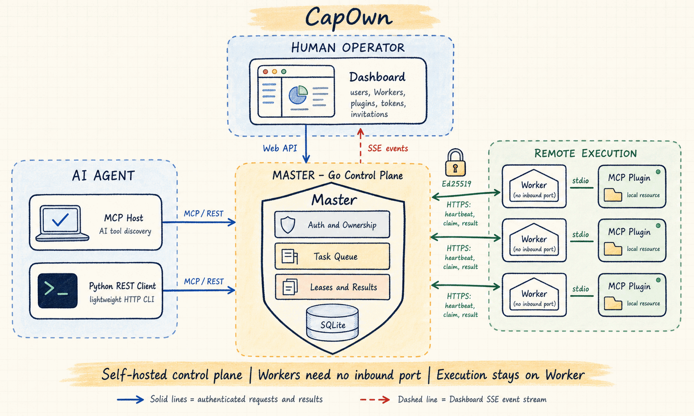

# 系统架构

<!-- SPDX-License-Identifier: Apache-2.0 -->

CapOwn 将全局控制职责和本机执行职责严格分离：Master 负责身份、授权、路由、队列、
交付租约、取消和结果关联；Worker 负责本机插件进程和工具调用。Master 从不直接执行
Worker 插件。



## 组件边界

| 组件 | 职责 | 不负责 |
| --- | --- | --- |
| Master | Go HTTP API、SQLite、用户与 Token、Worker 所有权、任务队列、MCP 入口、Dashboard SSE | 启动或调用 Worker 插件 |
| Worker | Node.js 生命周期、Ed25519 身份、心跳、领取任务、取消、本地 MCP stdio 插件 | 对外暴露入站服务、替 Master 做授权 |
| Dashboard | 浏览器管理界面、直接调用 Master、认证 SSE 消费 | 保存服务器端 Session、代理请求、执行插件 |
| Python Client | 标准库 REST 调用和命令行 | 定义第二套协议、保存服务端状态 |
| Plugin | Worker 本机受信任的 MCP-over-stdio 工具进程 | 绕过 Worker 或直接连接 Master |

`protocol/openapi.yaml` 是路由、请求响应、状态码、认证与 SSE 的唯一线协议定义；
Worker 的 TypeScript 类型和各端实现均从属该合约。

## Worker 生命周期

1. 操作者创建 Worker 注册凭据，Worker 执行 `capown-worker register <link>`。
2. Worker 生成或复用 Ed25519 密钥，带注册令牌向 `POST /v1/workers` 注册；令牌随后丢弃。
3. Worker 请求 nonce、签名其 UTF-8 字节并创建绑定到 Worker ID 的会话。
4. Worker 通过 `PUT /v1/workers/{worker_id}/runtime` 周期性上报运行时和插件快照。
5. Worker 持续长轮询 `POST /v1/workers/{worker_id}/jobs/claim`。这是任务和取消的**唯一**
   下行渠道。
6. Worker 领取任务后先以当前 `delivery_id` 确认 `running`，再调用本地插件；结束时向
   `PUT /v1/tasks/{task_id}/result` 回报结果。
7. 网络或会话失败时，Worker 重新认证并恢复心跳与 claim 循环；过期租约可由 Master 重新入队。

Dashboard SSE 只承载面向浏览器的管理事件，绝不能用于向 Worker 投递任务或取消。

## 任务与取消

```text
MCP Host / REST Client
        |
        | POST /v1/tasks
        v
Master: 授权 -> 入队 -> 交付租约
        |
        | Worker claim
        v
Worker: running 确认 -> 本地 MCP 插件调用
        |
        | PUT task result
        v
Master: 关联结果 -> 客户端 task_get / task_wait
```

当前可从客户端派发的任务类型为 `plugin_call`、`plugin_install` 和
`plugin_uninstall`。插件启用/禁用由专用 Worker 插件管理接口转换为内部任务。任务状态为
`pending`、`running`、`completed`、`failed`、`timeout` 或 `canceled`。

对于运行中的任务，取消请求会排入同一 Worker 的取消 job；Worker 领取后向插件传播
取消信号。待处理任务可以立即取消。客户端的同步等待有上界，超时后应使用任务 ID 继续
`task_get` 或 `task_wait`，而不是假定任务已结束。

## 认证与归属

| 凭据 | 前缀 | 使用范围 |
| --- | --- | --- |
| Web Session | `cown_web_*` | Dashboard 与 Web 管理接口 |
| Client Token | 不透明 Bearer Token | `/v1` 客户端操作和 `/mcp` |
| Worker Session | `cown_sess_*` | 绑定 Worker 的心跳、claim 和结果上报 |
| Worker 注册令牌 | `cown_register_*` | 新 Worker 注册，不能用于正常 API 调用 |

Master 同时校验 Token 类型和资源归属。普通用户只能看见和操作自己拥有的 Worker；管理员
拥有额外的账户和邀请管理权限。Worker Session 只能作用于它绑定的 Worker，结果上报也必须
来自任务目标 Worker。

## 数据与恢复

SQLite 持久保存用户、密码哈希、Token 哈希、注册凭据、Worker 所有权和目录信息。挑战、
Worker Session、任务队列与交付租约在当前 MVP 中存于内存。因而 Master 重启后 Worker 会
重新认证；正在进行或未完成的任务不应被视为长期审计记录。

Worker 本地身份、配置、插件清单、安装包和日志位于 `~/.capown/worker`。私钥、Client
Token、注册链接和数据库都属于敏感数据。

## 安全边界

- Worker 只主动访问 Master，但这不等同于网络隔离；Master、反向代理和浏览器访问面仍需
  按生产标准加固。
- 插件命令使用 argv 执行，不经 shell 插值；Master 不允许客户端指定插件可执行文件。
- registry 安装包必须使用 HTTPS 且校验 SHA-256，Master 会从受信任目录固定安装参数。
- 插件清单中的 `read_roots`、`write_roots`、`network` 是声明性边界，**不是**当前 Worker
  强制执行的操作系统沙箱。只安装和启用你信任的本机插件。
- `filesystem` 插件默认限定工作目录，但插件自身和其运行时仍属于 Worker 操作者的信任边界。

生产部署应使用 TLS、精确的 Dashboard Origin 允许列表、最小化文件权限和受控的进程托管。
